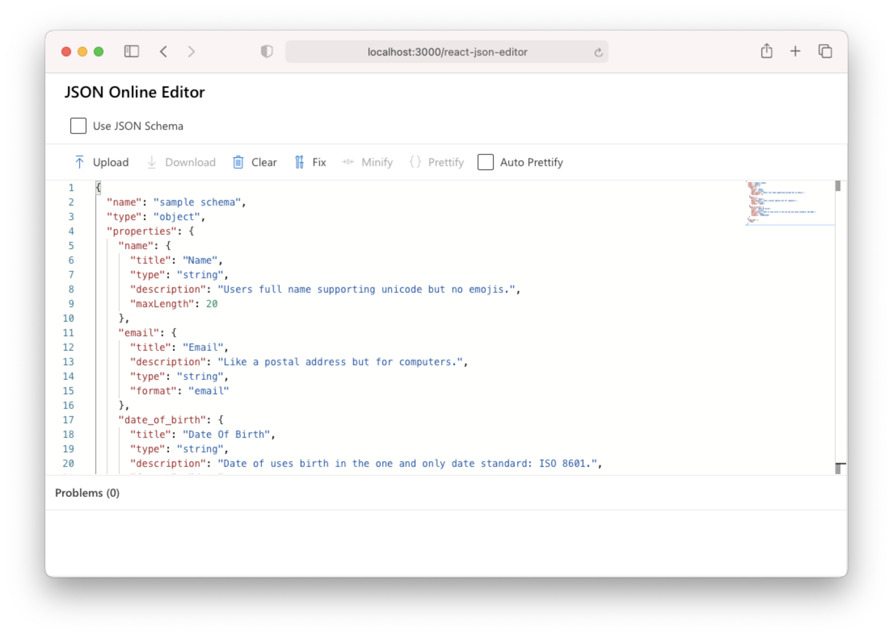

# 🖌 React JSON Editor

- Download / Upload JSON file
- JSON formatter: Minify, Prettify, Fix JSON content
- JSON Schema Validation

## Built with

- [create-react-app](https://reactjs.org/docs/create-a-new-react-app.html)
- [monaco-react](https://github.com/suren-atoyan/monaco-react)
- [fluentui-react](https://github.com/microsoft/fluentui)
- [dirty-json](https://github.com/RyanMarcus/dirty-json)

## Demo

Visit : https://sujinleeme.github.io/react-json-editor/

## Installation

Git clone this repo and run `yarn && yarn start`.

## Current Monaco Editor's Problems

### Testing

As the initialization process is supposed to load some scripts from CDN, there is a problem with Jest (and other testing tools). It only shows "Loading..." and never gets the editor working in the test.

See : https://github.com/suren-atoyan/monaco-react/issues/88

### Error-Message-Bar

`OnValidate`

In this web, there are multiple editor components and one of them has broken input, only onValidate of the last component is executed and it has the other component's markers values. The absence of the API for live model makers makes it harder to provide an alternative approach.

See: https://github.com/suren-atoyan/monaco-react/issues/182

## TODO

- Form integration
- Toast notification message

## License

MIT (2020)
